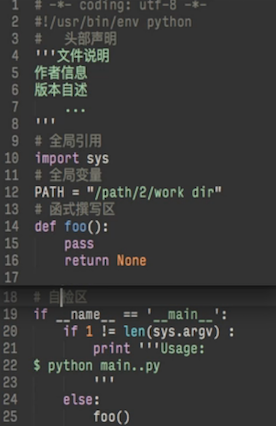
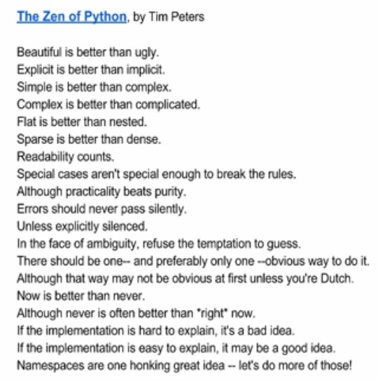
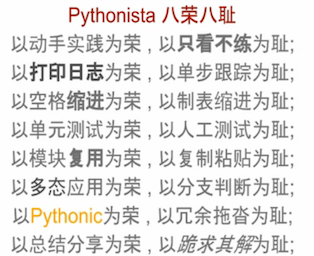

# 0MOOC ｜ 2wNote

 **20151022**
 ## 
###CLI：
- 感触：交互来得如此之快！
- 对策：无他，唯手熟尔。
    - [Introduction to the Apple OS X command line.](http://blog.teamtreehouse.com/introduction-to-the-mac-os-x-command-line)
    - [A-Z index of Apple OS X command line.](http://ss64.com/osx/)

###Python原模版:
- 感触：原模版之前，虽然《极简python入手导念》上也赫然写着自检区代码，又一次可耻的视而不见。公开课＋上周末C2T2培炎教练解释，方知其作用和必要性。那么，python是否还有其他类似的功能代码？
- 扩展：新手写函数常感同无米之炊，[python的内建函数](http://www.wklken.me/posts/2013/03/16/python-base-builtins.html)也是必要的工具，先做查阅，逐渐熟记。

### 笨办法是好办法
- 感触：当dama的每个操作都看上去那么新奇和好玩时，必须笨办法搬运之。
- 对策：see below.

—————————————笨办法分割线——————————————
### 一、什么是REPL
####描述 :输入什么，立即有什么输出反应
- read:读入
- eval:运行
- print：输出
- loop：循环

#### 探索：

- help()——REPL中，python内置了帮助。学习的最快方式。

    - e.g range:生成数组的常用工具 ［具体使用参考help（range)]

- dir:
    - 报告当前环境中有什么对象,e.g dir(a)
    - 以及对象都有什么操作 dir(a.sort)
    - 以及对象的操作有什么内置hook

- print
    - e.g print a
          print a[0]：打印第一个对象
          print a[1]：打印第二个对象
          print a+[4,5,6]：与另一数组相加
          len(a):a的长度

### 二、python脚本原模版
  
- 头部说明（固定的）：
    - ＃-*- coding: utf-8 -*- 
    - ＃!/user/bin/env python
    - ＃文件说明，作者信息，版本自述……（参考github上排名靠前的模块）
- 全局引用：
   - import sys
   >import是python里做的不太好的一个方面，so:
   1、import 内置模块
   2、import 第三方模块
   3、import 自己工程里的模块。
- 全局变量
- 函数撰写
- 自检区
    - if  \__name\__ == '\__main\____' 
    - *总调用的入口（直接引用）。当只需要引用模块的某些部分时， if  \__name\__ == '\__main\__'以下的代码不会被触发。*
    - 因而，模块既可作为行动单元，也可以作为语义单元。两者切换在自检区完成。
    
### 三、1W task详解
- 任务：交互笔记
    - 一次接受输入一行日记
    - 保存为本地文件
    - 再次运行系统时，能打印出过往所有日记

- 技术操作
    - raw_input()  从外界收到数据
    - while+break  用while进行就保持住了输入、交互；break来退出
    - os.path.exists 本地文件是否存在。详见[官方文档](http://www.wklken.me/posts/2013/03/16/python-base-builtins.html)。
    - open() 打开文件。内建的函数，随时可以用。
    - for...in  回读时的 for in 循环，in的对象是很任性的……
    
- <51行（包含注释）

- 演示
    - 环境初始化：
        - cat mydaily.log
        - rm mydaily.log
        
    - 调用
        - cat mydaly.log
        - python main.py
    - 目录
    

- 期待：持续训练命令行操作
    - 直觉的无参数调用 
> 桌面软件虽然便利但无可变性，熟悉命令行的操作模式
    - 直觉的默认帮助  
> ?/h/help
    - 持续的输入
> 试验再试验，体验成功的快感。
    - 直觉的退出 
> q/quit
    - 自动保存
> **不麻烦人的都不应该麻烦……**

### 四、一些技能小星星
#### 1、UTF-8的故事
部分演化史：
- ASC II(128个字符，英文环境）
- Unicode（符号集，100多万种字符）
- UTF-8(编码）——unicode实现之一，当前已是主流，拐点在08年。
> so,why"锟斤拷锟斤拷锟斤拷锟斤拷锟斤拷锟斤拷锟斤拷"?  
——过时的编码，泪……

So, "Keep clam and **be UTF-8.**" 

#### 2、善用搜索
- 如何搜索图片其他副本?

> e.g 《极简python上手导念》
- 快照 
- 七牛 bitbucket.org TW

- DAMA's design collection, including the .png in 《极简python上手导念》。

 

### 五、日颂三遍，开智不醉：
- use the force
- 靠谱：以最小代价解决问题
- 核心目标：提问——破壁
- 初级知识需要对高级知识深入了解才能真正深入了解。

————————————————————

附录：

### the zen of python

### 八荣八耻

